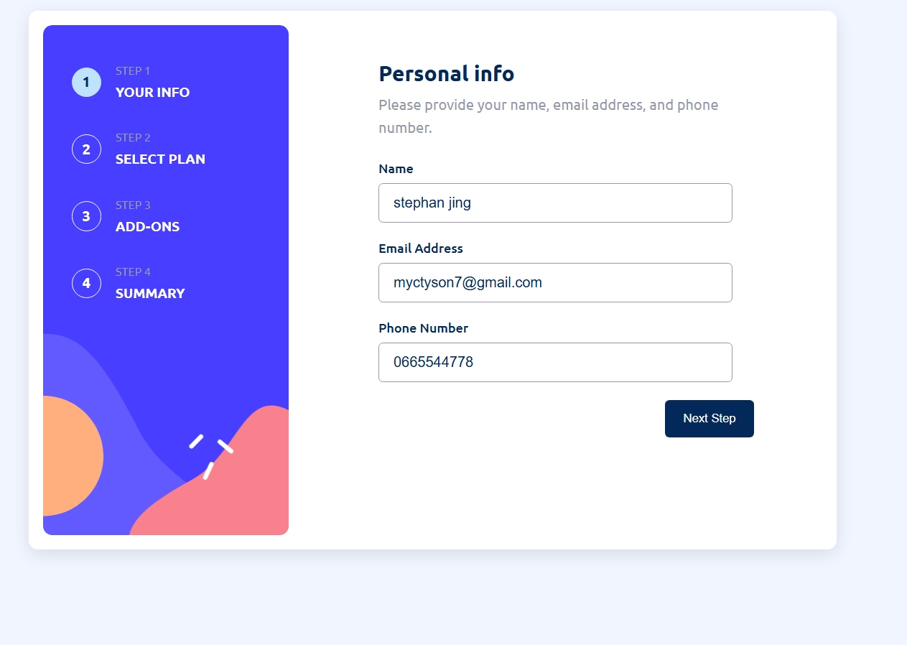

# Frontend Mentor - Multi-step form solution

This is a solution to the [Multi-step form challenge on Frontend Mentor](https://www.frontendmentor.io/challenges/multistep-form-YVAnSdqQBJ). Frontend Mentor challenges help you improve your coding skills by building realistic projects. 

## Table of contents

- [Overview](#overview)
  - [The challenge](#the-challenge)
  - [Screenshot](#screenshot)
  - [Links](#links)
- [My process](#my-process)
  - [Built with](#built-with)
  - [What I learned](#what-i-learned)
  - [Continued development](#continued-development)
  - [Useful resources](#useful-resources)
- [Author](#author)
- [Acknowledgments](#acknowledgments)

**Note: Delete this note and update the table of contents based on what sections you keep.**

## Overview

### The challenge

Users should be able to:

- Complete each step of the sequence
- Go back to a previous step to update their selections
- See a summary of their selections on the final step and confirm their order
- View the optimal layout for the interface depending on their device's screen size
- See hover and focus states for all interactive elements on the page
- Receive form validation messages if:
  - A field has been missed
  - The email address is not formatted correctly
  - A step is submitted, but no selection has been made

### Screenshot




### Links

- Solution URL: [Add solution URL here]([https://your-solution-url.com](https://github.com/Rodney-Mokenyu/multi-step-form-main))
- Live Site URL: [Add live site URL here]([https://your-live-site-url.com](https://rodney-mokenyu.github.io/multi-step-form-main/))

## My process

### Built with

- Semantic HTML5 markup
- CSS custom properties
- Flexbox
- CSS Grid
- Mobile-first workflow
- Vanilla Javascript


### What I learned

This project was a fantastic learning experience, especially in managing form state and dynamic UI updates without a framework.

Here are some key takeaways:

Centralized Data Management with JavaScript Objects: I learned how powerful a single JavaScript object (formData) can be for managing all the user's selections and inputs across multiple steps. This made it much easier to collect data for the final summary and calculate totals.
```html
<h1>Some HTML code I'm proud of</h1>
```
```css
.proud-of-this-css {
  color: papayawhip;
}
```
```js
const formData = {
    personalInfo: {
        name: '',
        email: '',
        phone: ''
    },
    plan: {
        name: null,
        monthlyPrice: 0,
        yearlyPrice: 0
    },
    isYearly: false,
    addOns: [],
    totalPrice: 0
};
```
Dynamic Price Updates: Implementing the monthly/yearly toggle was challenging but rewarding. I used data-* attributes in HTML to store prices and then used JavaScript to dynamically update the displayed prices for both plans and add-ons based on the isYearly state. This makes the pricing very flexible.
```js
function updatePricingUI() {
    const isYearly = formData.isYearly;
    const period = isYearly ? 'yr' : 'mo';
    // ... (loop through elements and update text content)
    priceEl.textContent = `$<span class="math-inline">\{isYearly ? yearlyPrice \: monthlyPrice\}/</span>{period}`;
}
```
Form Validation: Getting the form validation right for each step was crucial. I focused on showing clear error messages for missing fields or incorrect formats, and also preventing progression to the next step until inputs were valid or a plan was selected.
```js
function validateStep1() {
    let isValid = true;
    // ... (check validity and toggle 'is-invalid' class/error messages)
    return isValid;
}
```
CSS Layout for Responsiveness: I gained a lot of experience with Flexbox for laying out content, particularly with flex-direction, justify-content, and align-items to create both the mobile stacked layout and the desktop side-by-side layout. Managing heights and vertical centering on desktop to match the design's sidebar image was a tricky but satisfying part to get right.


### Continued development

I want to continue focusing on:

- Accessibility: While I tried to use semantic HTML, I want to delve deeper into ARIA attributes and keyboard navigation to ensure my forms are fully accessible to all users.
- More Complex State Management: For larger applications, managing state with vanilla JS can become cumbersome. I'd like to explore how a framework like React or a state management library could simplify this process for more intricate forms.
- CSS Transitions and Animations: I used basic transitions for hover states, but I'd like to implement more subtle and meaningful animations to improve the user experience, especially during step transitions or element selections.

### Useful resources

- [MDN Web Docs](https://developer.mozilla.org/en-US/) - Always my first stop for looking up HTML, CSS, and JavaScript properties and methods. Their examples are incredibly helpful.
- [W3Schools CSS Flexbox](https://www.w3schools.com/css/css3_flexbox.asp) - A good quick reference for Flexbox properties when I needed a reminder on how to align or distribute items.


## Author

- Github - [Oracle of Omaha](https://github.com/Rodney-Mokenyu)
- Frontend Mentor - [@Rodney-Mokenyu](https://www.frontendmentor.io/profile/Rodney-Mokenyu)
bove based on what links you'd like to share.**

## Acknowledgments

A big thanks to Frontend Mentor for providing such a well-structured and challenging project! It really pushed my understanding of client-side form logic and responsive design.
